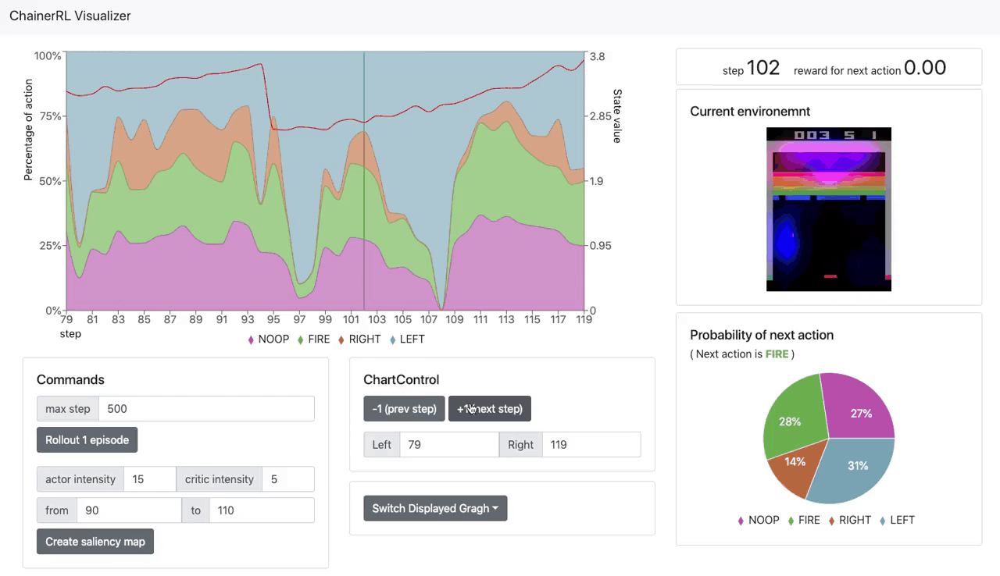

# ChainerRL Visualizer
You can analyze ChainerRL agent's behavior in well visualized way, making debug easier.

## Features


You can easily inspect your ChainerRL agent's behavior from browser UI.

- Rollout one episode from UI
- Tick timestep and env/agent behavior is well visualized
- If input of agent's model is raw pixel image, saliency map can be created
- Various ways of visualization are supported

#### NOTICE
- For now, even if input of agent's model is raw pixel image, saliency map cannot be created when your model includes RNN. This will be fixed.
- If you use `gym` environment of [classic control](https://github.com/openai/gym/tree/master/gym/envs/classic_control), env window can appear on display when sending rollout command from UI.

## Quick start
Follow instructions of each example.
- [CategoricalDQN at seaquest](examples/categorical_dqn_seaquest)
- [A3C at breakout](examples/a3c_breakout)
- [PPO at bipedalwalker-v2](examples/ppo_bipedalwalker_v2)

## Installation
To install ChainerRL Visualizer from source.

```sh
$ git clone https://github.com/pfnet/i18-sykwer.git
$ cd i18-sykwer/frontend
$ npm install && npm run build && cd ..
$ pip install -e .
```

## Usage
Just pass `agent` and `env` object to `chainerrl_visualizer.launch_visualizer` function.
```python
from chainerrl_visualizer import launch_visualizer

# Prepare agent and env object here
#

# Prepare dictionary which explains meanings of each action
ACTION_MEANINGS = {
  0: 'hoge',
  1: 'fuga',
  ...
}

launch_visualizer(
    agent,                           # required
    env,                             # required
    ACTION_MEANINGS,                 # required
    port=5002,                       # optional (default: 5002)
    log_dir='log_space',             # optional (default: 'log_space')
    raw_image_input=False,           # optional (default: False)
    contains_rnn=False,              # optional (default: False)
)
```
- `agent` object must be instance of [Agent class provided by ChainerRL](https://github.com/chainer/chainerrl/tree/master/chainerrl/agents), which extends `chainerrl.agent.Agent` class.
- `env` object must implement three gym-like methods below. Of course, gym's env object is accepted.
  - `reset`: Reset the environment to initial state.
  - `step` : Take `numpy.ndarray` action as argument, and proceed enviroment one step.
  - `render` : Return 3D `numpy.ndarray` which represents RGB image shaped `(height, width, 3)` describing env state.
- If you'd like to change this app's log directory name, you can specify one by passing the name to `log_dir` argument.
  This directory is assumed to be relative directory from python main execution.
- If your agent's model contains RNN part, you have to specify `contains_rnn=True`.
- If the input of your agent's model is raw image pixel data (or modified one), you have to specify `raw_image_input=True`.

## Env object interface
### reset
Reset the environment state and returns initial array-like observation object.
```
Returns:
  - observation (array-like object): agent's observation of the current environment
```

### step
Run the timestep of environment's dynamics.
```
Args:
  - action (numpy.ndarray): ndarray representing next action to take

Returns:
  - observation (array-like object): agent's observation of the current environment
  - reward (float): amount of reward returned after args action taken
  - done (boolean): whether the episode has ended or not
  - info (dict): contains various information helpful for debugging
```

### render
Returns 3d `numpy.ndarray` which represents RGB image of current environment appearance.
`render` method is assumed not to have any argument.
Though gym's env `render` method returns RGB `numpy.ndarray` only when `rgb_array=True` passed as `render` argument,
gym's env object will be wrapped in proper way inside this app and return RGB `numpy.ndarray` by default (So all you have to do is to pass gym env object).
```
Returns:
  - image (3d numpy.ndarray): RGB image of current environment appearance.
```

## NOTICE
### Not all agents supported yet
This library is under development and all modules in chainerrl are not supported yet.
Supported and unsupported modules are listed below.
If your agent's model returns unsupported one, this app will stop with error message.
- ActionValue
  - `DiscreteActionValue` : supported
  - `DistributionalDiscreteActionValue` : supported
  - `QuadraticActionValue` : unsupported
  - `SingleActionValue` : unsupported
- Distribution
  - `SoftmaxDistribution` : supported
  - `MellowmaxDistribution` : unsupported
  - `GaussianDistribution` : supported
  - `ContinuousDeterministicDistribution` : unsupported

### Saliency map restriction
For now, saliency map can be created only in situations below. This will be fixed in the future.
- Distribution is `SoftmaxDistribution` and `StateValue` is returned and `contains_rnn=False`
- ActionValue is `DiscreteActionValue` and `contains_run=False`

>>>>>>> master
### Bug workaround for MacOS
If you use MacOS, you may encounter a crash message below when sending `rollout` or `saliency` command from UI.
```bash
objc[42564]: +[__NSCFConstantString initialize] may have been in progress in another thread when fork() was called. We cannot safely call it or ignore it in the fork() child process. Crashing instead. Set a breakpoint on objc_initializeAfterForkError to debug.
```
This behavior is due to a change in high Sierra. If you would like to know detail, see [here](https://bugs.python.org/issue33725).
Workaround is to set environment variable `OBJC_DISABLE_INITIALIZE_FORK_SAFETY` to `YES` prior to executing python.
```bash
$ export OBJC_DISABLE_INITIALIZE_FORK_SAFETY=YES
```
